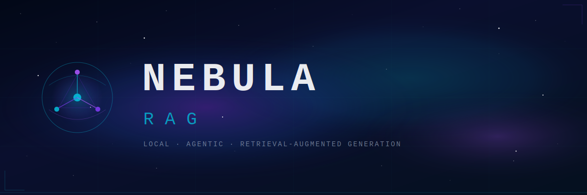

<div align="center">



**Production-oriented RAG for code and project knowledge — local, agentic, self-hosted**

[](https://dotnet.microsoft.com) [](https://github.com/MarkBovee/NebulaRAG/releases)
[](https://github.com/pgvector/pgvector)
[](https://modelcontextprotocol.io)
[](https://www.home-assistant.io)
[](LICENSE)

</div>

---

## What is NebulaRAG?

NebulaRAG is a self-hosted Retrieval-Augmented Generation platform that gives AI agents fast, code-aware context from your actual project sources — without sending anything to the cloud.

## MCP Integration for Plan Management

NebulaRAG now includes comprehensive MCP (Model Context Protocol) integration for plan lifecycle management. AI agents can create, manage, and track plans with full session validation and security enforcement.

### Available MCP Tools

- `create_plan`: Create a new plan with initial tasks
- `get_plan`: Retrieve a specific plan by ID
- `list_plans`: List all plans for the current session
- `update_plan`: Update plan details or status
- `complete_task`: Complete a specific task
- `update_task`: Update a specific task
- `archive_plan`: Archive a plan

### Session Validation

All MCP tools enforce session ownership validation, ensuring that agents can only access plans belonging to their session. Session validation is performed before any plan operation, providing robust security and data integrity.

### Usage Examples

```bash
# Create a new plan
curl -X POST http://localhost:8099/mcp -d '{
  "method": "tools/call",
  "params": {
    "name": "create_plan",
    "arguments": {
      "sessionId": "agent-session-1",
      "planName": "Project Planning",
      "projectId": "project-123",
      "initialTasks": ["Research requirements", "Design architecture", "Implement features"]
    }
  }
}'

# Get a specific plan
curl -X POST http://localhost:8099/mcp -d '{
  "method": "tools/call",
  "params": {
    "name": "get_plan",
    "arguments": {
      "sessionId": "agent-session-1",
      "planId": "plan-123"
    }
  }
}'

# List all plans for a session
curl -X POST http://localhost:8099/mcp -d '{
  "method": "tools/call",
  "params": {
    "name": "list_plans",
    "arguments": {
      "sessionId": "agent-session-1"
    }
  }
}'
```

### Security Features

- Session-based access control
- One active plan per session enforcement
- Proper error handling for invalid sessions
- JSON-RPC compliance
- Comprehensive logging and error reporting

It combines:
- A **.NET core retrieval engine** — chunking, embeddings, pgvector storage
- A **local CLI** for indexing and querying
- **MCP endpoints** for agents and editor tooling (VS Code, Claude Code, Cursor)
- A **Home Assistant add-on** with a built-in TypeScript web dashboard

---

## Why NebulaRAG?

- **Local-first** — PostgreSQL + pgvector, nothing leaves your machine
- **Agent-ready** — MCP tooling surface with RAG + persistent memory
- **Clean architecture** — core engine, transport adapters, and host runtime are fully separated
- **Operational from day one** — indexing, source management, health checks, and stats all included
- **One-line install** — PowerShell setup script handles MCP registration for VS Code and Claude Code

---

## What is RAG?

Retrieval-Augmented Generation augments AI models with retrieved context from an indexed corpus. NebulaRAG indexes your code, docs, tests, and architecture notes so agent queries are grounded in your actual sources — not hallucinated guesses.

**Common uses:**
- Code-aware Q&A and onboarding
- Investigating complex or high-risk code areas
- Understanding indexing and storage flows
- Auditing registered sources and index health
- Auto-assisting pull requests with precise context

---

## Quick Install (Windows + PowerShell)

```powershell
$scriptUrl='https://raw.githubusercontent.com/MarkBovee/NebulaRAG/main/scripts/setup-nebula-rag.ps1'
$scriptPath=Join-Path ([System.IO.Path]::GetTempPath()) 'setup-nebula-rag.ps1'
Remove-Item -LiteralPath $scriptPath -Force -ErrorAction SilentlyContinue
Invoke-WebRequest -Uri $scriptUrl -OutFile $scriptPath -ErrorAction Stop
& $scriptPath
```

Downloads the setup script and configures user-level MCP registration for VS Code and Claude Code.

---

## Quick Start

### Local CLI

```powershell
dotnet run --project src\NebulaRAG.Cli -- init
dotnet run --project src\NebulaRAG.Cli -- index --source .
dotnet run --project src\NebulaRAG.Cli -- query --text "How is MCP transport handled?"
```

### MCP (stdio)

```powershell
dotnet run --project src\NebulaRAG.Mcp -- --config src\NebulaRAG.Cli\ragsettings.json
```

### Docker Compose

```powershell
cp .env.example .env
# edit .env with your database settings
docker compose up -d
```

### Home Assistant Add-on

1. Add repository: `https://github.com/MarkBovee/NebulaRAG`
2. Install the **Nebula RAG** add-on
3. Configure `database.*` options
4. Start the add-on and open ingress

| Endpoint | URL |
|---|---|
| UI | `http://homeassistant.local:8099/nebula/` |
| Dashboard | `http://homeassistant.local:8099/nebula/dashboard/` |
| MCP JSON-RPC | `http://homeassistant.local:8099/nebula/mcp` |

---

## Setup Script Examples

**User-level setup — Home Assistant add-on:**
```powershell
pwsh -File .\scripts\setup-nebula-rag.ps1 `
  -Mode User `
  -ClientTargets Both `
  -InstallTarget HomeAssistantAddon `
  -HomeAssistantMcpUrl http://homeassistant.local:8099/nebula/mcp `
  -Force
```

**Local container mode:**
```powershell
pwsh -File .\scripts\setup-nebula-rag.ps1 `
  -Mode User `
  -InstallTarget LocalContainer `
  -CreateEnvTemplate `
  -Force
```

---

## System Overview

```
┌─────────────────────────────────────────────────────────────┐
│           AI Agent / Editor                                  │
│   Claude Code · VS Code Copilot · Cursor · CLI              │
└────────────────────────┬────────────────────────────────────┘
                         │  MCP (stdio or HTTP JSON-RPC)
         ┌───────────────┴──────────────────┐
         │         NebulaRAG Server          │
         │  ┌──────────┐  ┌──────────────┐  │
         │  │ MCP Tools│  │ REST / Ingress│  │
         │  └────┬─────┘  └──────┬───────┘  │
         │       └────────┬──────┘          │
         │         ┌──────▼──────┐          │
         │         │ Core Engine │          │
         │         │ RAG + Memory│          │
         │         └──────┬──────┘          │
         └────────────────┼─────────────────┘
                          │
          ┌───────────────▼──────────────────┐
          │     PostgreSQL + pgvector         │
          │  ┌──────────┐  ┌──────────────┐  │
          │  │  chunks  │  │   memories   │  │
          │  └──────────┘  └──────────────┘  │
          └──────────────────────────────────┘
```

---

## Project Structure

```
NebulaRAG/
├── src/
│   ├── NebulaRAG.Core/        # Chunking, embeddings, storage, query services
│   ├── NebulaRAG.Cli/         # CLI: init · index · query
│   ├── NebulaRAG.Mcp/         # stdio MCP adapter
│   └── NebulaRAG.AddonHost/   # HTTP host: Home Assistant ingress + MCP endpoint
├── dashboard/                 # TypeScript web dashboard
├── container/                 # Container configuration
├── nebula-rag/                # Home Assistant add-on package + release metadata
├── scripts/                   # PowerShell setup scripts
├── tests/
│   └── NebulaRAG.Tests/
├── .mcp.json                  # MCP config (Claude Code)
├── copilot.mcp.json           # MCP config (VS Code Copilot)
├── AGENTS.md                  # Agent instruction file
├── compose.yaml               # Docker Compose stack
└── .env.example               # Environment template
```

---

## MCP Tools

### RAG

| Tool | Description |
|---|---|
| `query_project_rag` | Semantic search over indexed sources |
| `rag_init_schema` | Initialize database schema |
| `rag_health_check` | Check system health |
| `rag_server_info` | Server and model info |
| `rag_index_stats` | Chunk counts per source |
| `rag_list_sources` | List all indexed sources |
| `rag_index_path` | Index a local directory or file |
| `rag_index_text` | Index raw text directly |
| `rag_index_url` | Fetch and index a URL |
| `rag_reindex_source` | Reindex an existing source |
| `rag_get_chunk` | Retrieve a specific chunk by ID |
| `rag_search_similar` | Similarity search without source filter |
| `rag_normalize_source_paths` | Normalize stored source paths |
| `rag_delete_source` | Remove a source from the index |
| `rag_purge_all` | Clear the entire index |

### Memory

| Tool | Description |
|---|---|
| `memory_store` | Store an agent memory |
| `memory_recall` | Semantic search over memories |
| `memory_list` | List memories by tag or type |
| `memory_update` | Update an existing memory |
| `memory_delete` | Delete a specific memory |

> `rag-sources.md` is automatically synchronized after every index, delete, and purge operation.  
> The `memories` table and indexes are created automatically on `rag_init_schema`.

---

## Agent Setup

NebulaRAG ships with `AGENTS.md` — an instruction file that tells your agent when to query RAG vs memory, when to write to memory, and which conventions this project follows.

MCP configs for Claude Code (`.mcp.json`) and VS Code Copilot (`copilot.mcp.json`) are included in the repository root and registered automatically by the setup script.

---

## Security

- Vulnerability policy: [`SECURITY.md`](SECURITY.md)
- Code ownership: [`.github/CODEOWNERS`](.github/CODEOWNERS)
- Dependency maintenance: [`.github/dependabot.yml`](.github/dependabot.yml)
- Security workflow: [`.github/workflows/security.yml`](.github/workflows/security.yml)

**Never commit secrets or credential-bearing env files.**

---

## Contributing

1. Create a branch from `main`
2. Keep changes scoped — follow the instructions in `AGENTS.md`
3. Run tests and checks
4. Open a PR with a clear change summary

---

<div align="center">

Built for developers who want AI that knows their codebase — not someone else's.

</div>
