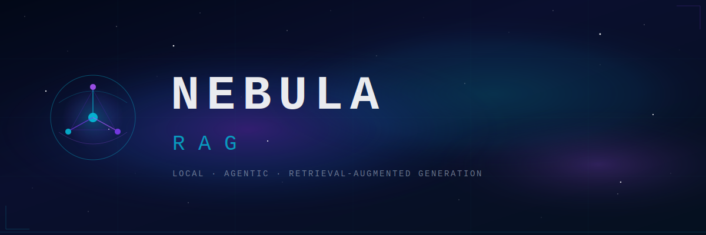

<div align="center">



**Production-oriented RAG for code and project knowledge — local, agentic, self-hosted**

[](https://dotnet.microsoft.com) [](https://github.com/MarkBovee/NebulaRAG/releases)
[](https://github.com/pgvector/pgvector)
[](https://modelcontextprotocol.io)
[](https://www.home-assistant.io)
[](LICENSE)

</div>

---

## What is NebulaRAG?

NebulaRAG is a self-hosted Retrieval-Augmented Generation platform that gives AI agents fast, code-aware context from your actual project sources — without sending anything to the cloud.

## MCP Integration for RAG and Memory

NebulaRAG includes a broad MCP (Model Context Protocol) integration for retrieval, indexing, and memory operations.

### Unified MCP Tools

- `rag_query`: Unified semantic query operations (`project`, `similar`)
- `rag_ingest`: Unified indexing operations (`path`, `text`, `url`, `reindex`)
- `rag_sources`: Unified source operations (`list`, `get_chunk`, `delete`, `normalize`)
- `rag_admin`: Unified admin operations (`init_schema`, `health`, `stats`, `purge`)
- `memory`: Unified memory operations (`store`, `recall`, `list`, `update`, `delete`)
- `system`: Unified system metadata operations (`server_info`)

### tools/list Profiles

- `tools/list` returns a `minimal` profile with only the unified tool set.

### Security Features

- Optional session and project metadata for scoped memory operations
- Proper error handling for invalid sessions
- JSON-RPC compliance
- Comprehensive logging and error reporting

It combines:
- A **.NET core retrieval engine** — chunking, embeddings, pgvector storage
- A **local CLI** for indexing and querying
- **MCP endpoints** for agents and editor tooling (Copilot CLI, Claude Code, Cursor)
- A **Home Assistant add-on** with a built-in Blazor flight deck for overview, RAG, and memory operations

---

## Why NebulaRAG?

- **Local-first** — PostgreSQL + pgvector, nothing leaves your machine
- **Agent-ready** — MCP tooling surface with RAG + persistent memory
- **Lean retrieval defaults** — semantic queries default to a smaller result fan-out, boost exact path hits, and fall back to PostgreSQL full-text search when semantic recall is weak
- **Clean architecture** — core engine, transport adapters, and host runtime are fully separated
- **Operational from day one** — indexing, source management, health checks, and stats all included
- **One-line install** — PowerShell or Bash setup scripts handle Copilot CLI + Claude Code MCP registration and project-local hook scaffolding

---

## Roadmap

The current product roadmap is tracked in `ROADMAP.md`.

That roadmap is focused on making NebulaRAG the default setup, MCP, RAG, memory, and session-continuity stack for Nebula-centric workflows.

---

## What is RAG?

Retrieval-Augmented Generation augments AI models with retrieved context from an indexed corpus. NebulaRAG indexes your code, docs, tests, and architecture notes so agent queries are grounded in your actual sources — not hallucinated guesses.

**Common uses:**
- Code-aware Q&A and onboarding
- Investigating complex or high-risk code areas
- Understanding indexing and storage flows
- Auditing registered sources and index health
- Auto-assisting pull requests with precise context

---

## Quick Install

### Windows + PowerShell

```powershell
$scriptUrl='https://raw.githubusercontent.com/MarkBovee/NebulaRAG/main/scripts/setup-nebula-rag.ps1'
$scriptPath=Join-Path ([System.IO.Path]::GetTempPath()) 'setup-nebula-rag.ps1'
Remove-Item -LiteralPath $scriptPath -Force -ErrorAction SilentlyContinue
Invoke-WebRequest -Uri $scriptUrl -OutFile $scriptPath -ErrorAction Stop
& $scriptPath
```

Downloads the setup script and configures user-level MCP registration for Copilot CLI and Claude Code.

The same script is also the canonical way to scaffold Nebula instruction files, Claude hook settings, and Copilot hook files into a project.

### Linux/macOS + Bash

```bash
script_url='https://raw.githubusercontent.com/MarkBovee/NebulaRAG/main/scripts/setup-nebula-rag.sh'
script_path="${TMPDIR:-/tmp}/setup-nebula-rag.sh"
rm -f "$script_path"
curl -fsSL "$script_url" -o "$script_path"
bash "$script_path"
```

The Bash installer writes the same user-level MCP registrations, merges Bash-based Claude hook settings, and scaffolds both `.ps1` and `.sh` shared hook runners so the project bundle works across Windows and Unix environments.

### WSL mounted-drive guard

If you build .NET repos from WSL under `/mnt/*`, mounted Windows drives can leave `MSBuildTemp*` and other transient directories in the repo root. Install the WSL guard once per WSL user to block those builds and push you toward a Linux-side workspace instead:

```bash
bash ./scripts/install-wsl-dotnet-guard.sh --force
```

When you need to clean an already-polluted repo, NebulaRAG now includes a targeted cleanup command:

```powershell
dotnet run --project src\NebulaRAG.Cli -- cleanup-build-artifacts --source . --dry-run
```

---

## Quick Start

### Local CLI

```powershell
dotnet run --project src\NebulaRAG.Cli -- init
dotnet run --project src\NebulaRAG.Cli -- index --source .
dotnet run --project src\NebulaRAG.Cli -- query --text "How is MCP transport handled?"
dotnet run --project src\NebulaRAG.Cli -- cleanup-build-artifacts --source .
```

### MCP (stdio)

```powershell
dotnet run --project src\NebulaRAG.Mcp -- --config src\NebulaRAG.Cli\ragsettings.json
```

### Docker Compose

```powershell
cp .env.example .env
# edit .env with your database settings
docker compose up -d
```

### Home Assistant Add-on

1. Add repository: `https://github.com/MarkBovee/NebulaRAG`
2. Install the **Nebula RAG** add-on
3. Configure `database.*` options
4. Start the add-on and open ingress

The ingress dashboard exposes a project switcher and three operator tabs:

- `Project switcher` to keep the dashboard centered on one project when doing CRUD or investigation work.
- `Overview` for health, telemetry, activity, and project breakdown.
- `Rag` for semantic query, indexing, and source maintenance.
- `Memory` for scoped analytics, recall, and memory editing.

| Endpoint | URL |
|---|---|
| UI | `http://homeassistant.local:8099/nebula/` |
| Dashboard | `http://homeassistant.local:8099/nebula/dashboard/` |
| MCP JSON-RPC | `http://homeassistant.local:8099/nebula/mcp` |

---

## Setup Script Examples

**Full setup — user config plus project scaffolding:**
```powershell
pwsh -File .\scripts\setup-nebula-rag.ps1 `
  -Mode Both `
  -TargetPath C:\src\my-project `
  -ClientTargets Both `
  -InstallTarget HomeAssistantAddon `
  -HomeAssistantMcpUrl http://homeassistant.local:8099/nebula/mcp `
  -Force
```

**User-level config only:**
```powershell
pwsh -File .\scripts\setup-nebula-rag.ps1 `
  -Mode User `
  -ClientTargets Both `
  -InstallTarget HomeAssistantAddon `
  -Force
```

**Project scaffolding only:**
```powershell
pwsh -File .\scripts\setup-nebula-rag.ps1 `
  -Mode Project `
  -TargetPath C:\src\my-project `
  -ClientTargets Both `
  -InstallTarget HomeAssistantAddon `
  -Force
```

**Local container mode:**
```powershell
pwsh -File .\scripts\setup-nebula-rag.ps1 `
  -Mode Both `
  -TargetPath C:\src\my-project `
  -ClientTargets Both `
  -InstallTarget LocalContainer `
  -CreateEnvTemplate `
  -Force
```

**Full setup on Linux/macOS:**
```bash
bash ./scripts/setup-nebula-rag.sh \
  --mode Both \
  --target-path ~/src/my-project \
  --client-targets Both \
  --install-target HomeAssistantAddon \
  --home-assistant-mcp-url http://homeassistant.local:8099/nebula/mcp \
  --force
```

**Local container mode on Linux/macOS:**
```bash
bash ./scripts/setup-nebula-rag.sh \
  --mode Both \
  --target-path ~/src/my-project \
  --client-targets Both \
  --install-target LocalContainer \
  --create-env-template \
  --force
```

---

## System Overview

```
┌─────────────────────────────────────────────────────────────┐
│           AI Agent / Editor                                  │
│   Claude Code · Copilot CLI · Cursor · CLI                  │
└────────────────────────┬────────────────────────────────────┘
                         │  MCP (stdio or HTTP JSON-RPC)
         ┌───────────────┴──────────────────┐
         │         NebulaRAG Server          │
         │  ┌──────────┐  ┌──────────────┐  │
         │  │ MCP Tools│  │ REST / Ingress│  │
         │  └────┬─────┘  └──────┬───────┘  │
         │       └────────┬──────┘          │
         │         ┌──────▼──────┐          │
         │         │ Core Engine │          │
         │         │ RAG + Memory│          │
         │         └──────┬──────┘          │
         └────────────────┼─────────────────┘
                          │
          ┌───────────────▼──────────────────┐
          │     PostgreSQL + pgvector         │
          │  ┌──────────┐  ┌──────────────┐  │
          │  │  chunks  │  │   memories   │  │
          │  └──────────┘  └──────────────┘  │
          └──────────────────────────────────┘
```

---

## Project Structure

```
NebulaRAG/
├── src/
│   ├── NebulaRAG.Core/        # Chunking, embeddings, storage, query services
│   ├── NebulaRAG.Cli/         # CLI: init · index · query
│   ├── NebulaRAG.Mcp/         # stdio MCP adapter
│   └── NebulaRAG.AddonHost/   # HTTP host: Home Assistant ingress + MCP endpoint + Blazor dashboard
├── container/                 # Container configuration
├── nebula-rag/                # Home Assistant add-on package + release metadata
├── scripts/                   # PowerShell and Bash setup scripts
├── designs/                   # Design artifacts and working assets
├── tests/
│   └── NebulaRAG.Tests/
├── .claude/settings.json      # Claude Code project hooks
├── .mcp.json                  # Claude Code project MCP config
├── .github/hooks/             # Copilot CLI hook config files
├── .github/nebula/hooks/      # Shared Nebula hook scripts for PowerShell and Bash
├── ROADMAP.md                 # Product roadmap and adoption phases
├── AGENTS.md                  # Agent instruction file
├── compose.yaml               # Docker Compose stack
└── .env.example               # Environment template
```

---

## MCP Tools

### RAG

| Tool | Description |
|---|---|
| `rag_query` | Unified semantic query operations (`project`, `similar`) |
| `rag_ingest` | Unified indexing operations (`path`, `text`, `url`, `reindex`) |
| `rag_sources` | Unified source operations (`list`, `get_chunk`, `delete`, `normalize`) |
| `rag_admin` | Unified admin operations (`init_schema`, `health`, `stats`, `purge`) |
| `system` | Runtime server metadata (`server_info`) |

`rag_ingest` with `mode: "path"` accepts both directory and single-file source paths.

### Memory

| Tool | Description |
|---|---|
| `memory` | Unified memory operations (`store`, `recall`, `list`, `update`, `delete`, `sync`) |
| `nebula_setup` | Hook management (`install-hooks`, `uninstall-hooks`, `status`) |

> The `memories` table and indexes are created automatically through `rag_admin` with action `init_schema`.

---

## Agent Setup

NebulaRAG ships with `AGENTS.md` — an instruction file that tells your agent when to query RAG vs memory, when to write to memory, and which conventions this project follows.

NebulaRAG now also ships with `.github/nebula.instructions.md` as the canonical human-facing setup and operating guide. The setup script scaffolds this file alongside the client-specific compatibility files.

The current scaffolded instruction bundle is:

- `.github/nebula.instructions.md`
- `AGENTS.md`
- `.github/copilot-instructions.md`
- `.github/instructions/coding.instructions.md`
- `.github/instructions/documentation.instructions.md`
- `.github/instructions/rag.instructions.md`
- `.github/skills/nebularag/SKILL.md`
- `.claude/settings.json`
- `.github/hooks/nebula-balanced.json`
- `.github/nebula/hooks/Invoke-NebulaAgentHook.ps1`
- `.github/nebula/hooks/Invoke-NebulaAgentHook.sh`

The installers write user-level MCP config to `~/.claude.json` and `~/.copilot/mcp-config.json`, write project-scoped Claude MCP config to `.mcp.json`, and scaffold balanced hook profiles for Claude Code and Copilot CLI into the project. Use `scripts/setup-nebula-rag.ps1` on Windows and `scripts/setup-nebula-rag.sh` on Linux/macOS.

### Intake Prompt Commands

For lightweight planning intake, this repository now includes two prompt commands:

- `/new-feature` - run a short questioning loop to capture feature-level decisions and constraints
- `/new-project` - run a short questioning loop to capture project-level scope and outcomes

Both commands use the shared intake skill at `.github/skills/intake-questioning/SKILL.md` and produce a structured handoff that can be used as planning input.

---

## Security

- Vulnerability policy: [`SECURITY.md`](SECURITY.md)
- Code ownership: [`.github/CODEOWNERS`](.github/CODEOWNERS)
- Dependency maintenance: [`.github/dependabot.yml`](.github/dependabot.yml)
- Security workflow: [`.github/workflows/security.yml`](.github/workflows/security.yml)

**Never commit secrets or credential-bearing env files.**

---

## Auto-Memory Sync

Nebula automatically bridges Claude Code auto-memory files into the RAG index, prunes stale memories, and reindexes dirty sources.

It can also push the current repository knowledge base into Nebula with `sync-repo-knowledge`, which indexes the working tree as a `repo-knowledge` project source. That gives Nebula a shared project corpus for repo docs, instructions, and code-aware context.

### How It Works

Call `memory(action: "sync")` to run a three-phase maintenance pass:

1. **Auto-Memory Bridge** — Globs `~/.claude/projects/*/memory/*.md`, hashes each file, and ingests new or changed files into the RAG index under `auto-memory:<project-slug>` source tags. Unchanged files are skipped.
2. **Stale Memory Pruning** — Removes auto-memory entries older than `AutoMemory.RetentionDays` (default: 30 days). Set to `0` to disable.
3. **Dirty Source Reindex** — Compares SHA-256 hashes for all tracked RAG sources. Reindexes only sources whose content has changed since last index.

### Syncing Repository Knowledge

Use the CLI command below to push the current repository knowledge base into Nebula:

```powershell
dotnet run --project src\NebulaRAG.Cli -- sync-repo-knowledge --source . --project-id repo-knowledge
```

The default Stop hook now runs this command so repo documentation and code remain queryable as shared project knowledge.

### Installing the Stop Hook

To run sync automatically on session end, install the Claude Code Stop hook:

```json
{ "name": "nebula_setup", "arguments": { "action": "install-hooks" } }
```

Or for GitHub Copilot:
```json
{ "name": "nebula_setup", "arguments": { "action": "install-hooks", "client": "copilot" } }
```

### Checking Status

```json
{ "name": "nebula_setup", "arguments": { "action": "status" } }
```

Returns hook installation status and endpoint health for all supported clients.

### Configuration

Add to `ragsettings.json`:

```json
{
  "AutoMemory": {
    "BaseDirectory": "~/.claude/projects",
    "RetentionDays": 30
  }
}
```

---

## Contributing

1. Create a branch from `main`
2. Keep changes scoped — follow the instructions in `AGENTS.md`
3. Run tests and checks
4. Open a PR with a clear change summary

---

<div align="center">

Built for developers who want AI that knows their codebase — not someone else's.

</div>
